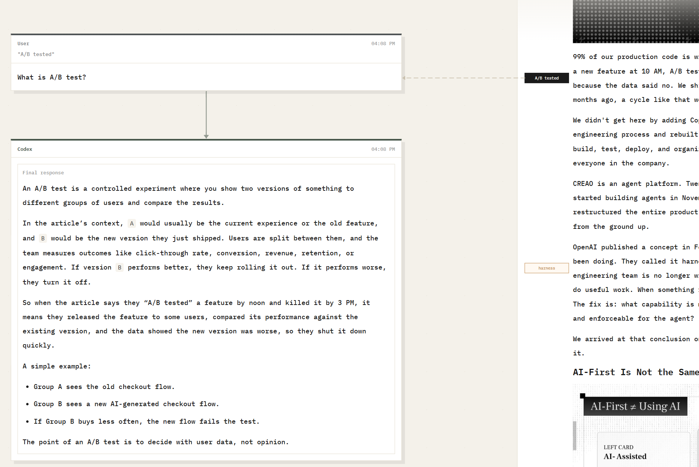

# NetChat

NetChat turns linear AI chat into a branching workspace for learning, deep dives, brainstorming, or any parallel exploration using your local agent harness.

```bash
npm install -g @danielwyq/netchat
```



## How it works

NetChat connects your local Claude Code and Codex to a web interface.

You keep your own agent setup. NetChat gives it a clearer surface for thinking and exploring.

Branching from a tail AI message uses native branch capability of Claude Code and Codex, while branching from a non-tail AI message, for now, is pseudo-branching, replaying previous conversations without cache.

## Quick start

### Install @danielwyq/netchat

```bash
npm install -g @danielwyq/netchat
```

Run `netchat` under your desired path in terminal.

### Start without installing

Run under your desired path in terminal:

```bash
npx @danielwyq/netchat
```

## Requirements

- Node.js `>=20`
- Claude Code or Codex installed and configured
